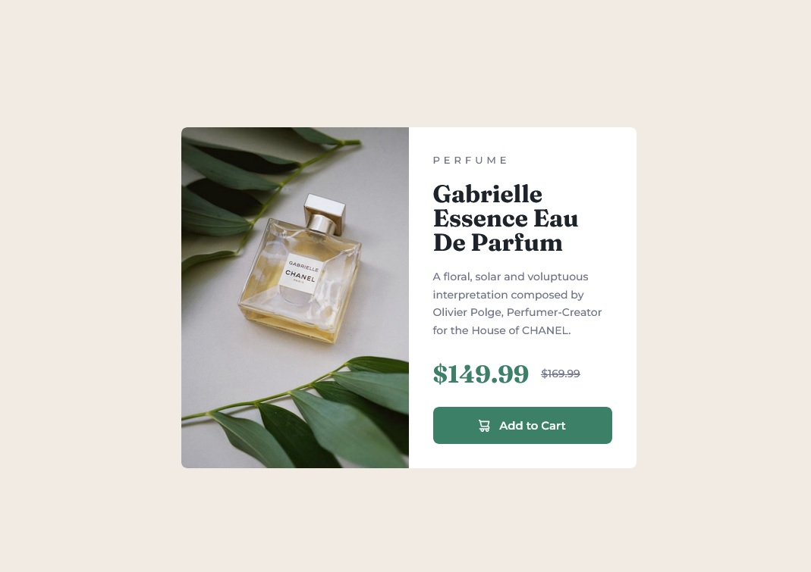

# Frontend Mentor - Product preview card component solution

This is a solution to the [Product preview card component challenge on Frontend Mentor](https://www.frontendmentor.io/challenges/product-preview-card-component-GO7UmttRfa). Frontend Mentor challenges help you improve your coding skills by building realistic projects. 

## Table of contents

- [Overview](#overview)
  - [The challenge](#the-challenge)
  - [Screenshot](#screenshot)
  - [Links](#links)
- [My process](#my-process)
  - [Built with](#built-with)
  - [What I learned](#what-i-learned)
  - [Continued development](#continued-development)
  - [Useful resources](#useful-resources)
- [Author](#author)
- [Acknowledgments](#acknowledgments)

## Overview

### The challenge

Users should be able to:

- View the optimal layout depending on their device's screen size
- See hover and focus states for interactive elements

### Screenshot



### Links

- [My solution](https://github.com/ffernandocosta/product-preview-card-component-main )
- [Live version](https://ffernandocosta.github.io/product-preview-card-component-main/)

## My process

### Built with

- Semantic HTML5 markup
- CSS custom properties
- Flexbox
- CSS Grid
- Mobile-first workflow


### What I learned

I learned how to do a responsive mode using media queries. Creating custom properties with variables so it's easier to style everything and to change or add more stuff to this project. Learned how to make content inclusive using ['Inclusively Hidden'](https://www.scottohara.me/blog/2017/04/14/inclusively-hidden.html). And also learned how to add pictures to my project using the tag element 'picture' and 'source'. I used to change my picture from mobile version to desktop version depending on the screen size.


```html
<h1>Some HTML code I'm proud of</h1>
  <picture class="product__img">
        <source srcset="images/image-product-desktop.jpg" media="(min-width: 600px)">
        
      </picture>
```
```css
.proud-of-this-css {
  .visually-hidden:not(:focus):not(:active) 
    clip: rect(0 0 0 0);
    clip-path: inset(50%);
    height: 1px;
    overflow: hidden;
    position: absolute;
    white-space: nowrap;
    width: 1px;
}
```

### Continued development

On my future projects I want to tackle a little more complex projects and hopefully using JavaScript as well.


### Useful resources

- [Kevin Powell](https://www.youtube.com/watch?v=B2WL6KkqhLQ&list=PL4-IK0AVhVjPregcc6pgAIerVqSWaJEM4) - Helped me a lot with writing css variables and I will use this style of writing on my future projects.
- [Inclusively Hidden](https://www.scottohara.me/blog/2017/04/14/inclusively-hidden.html) - This is an awesome article about hiding content and making it accessible.

## Author

- GitHub - [Fernando Costa](https://github.com/ffernandocosta)


## Acknowledgments

Many thanks to [Kevin Powell](https://www.youtube.com/@KevinPowell) for this amazing guide on how to takle this project and all the techniques that I learned on this I will put it to use on my own on my future projects.
